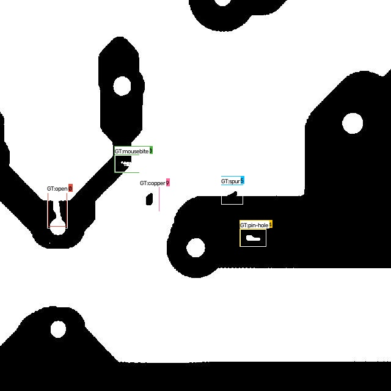
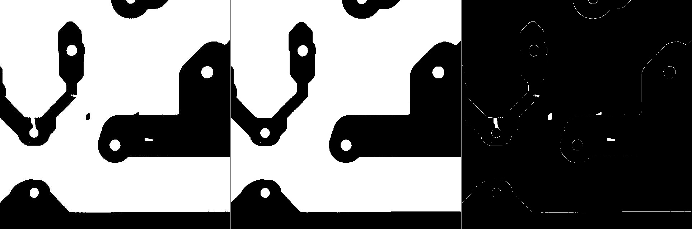

# DeepPCB 缺陷检测 Demo

基于 [DeepPCB 数据集](https://github.com/tangsanli5201/DeepPCB)（Tang et al., arXiv:1902.06197）的
PCB 表面缺陷检测完整流水线：**数据转换 → YOLO 训练 → 官方协议评估 → Gradio 可视化**。

核心结果：**YOLOv8n + 模板差分输入通道，官方协议 mAP@0.33 = 99.25% / F-score = 98.04%**，
超过原论文 GPP 模型（98.6% mAP / 98.2% F-score）——而原论文方法代码并未开源。

| 检测结果（绿/彩色=预测，白=GT） | 模板差分三联视图 |
|---|---|
|  |  |

| 对比 | 原论文 GPP 模型 | 本项目（YOLOv8n + 差分通道） |
|---|---|---|
| mAP@0.33 | 98.6% | **99.25%** |
| F-score | 98.2% | 98.04%（最优阈值 0.47） |
| 代码开源 | 未开源 | ✅ 全流程开源（数据转换/训练/评估/可视化） |

- 检测框架：[ultralytics YOLOv8](https://github.com/ultralytics/ultralytics)
- 图像处理：OpenCV
- Python 环境：conda `cv`（Python 3.12 / ultralytics 8.4 / OpenCV 5 / RTX 3060 实测）
- 延伸文档：见 [docs/](docs/)（数据集详解、论文解读、消融实验全记录）

```
DeepPCB_demo/
├── README.md
├── LICENSE                     # MIT（与原 DeepPCB 仓库一致）
├── CITATION.cff
├── requirements.txt
├── configs/config.yaml         # 全局配置（数据路径/类别/训练/评估参数，已固化消融最优值）
├── pcbdet/                     # 核心包
│   ├── config.py               # 配置加载（数据路径支持环境变量/--data-root 覆盖）
│   ├── convert_yolo.py         # DeepPCB -> YOLO 转换 + E6 三通道差分数据集构建
│   └── evaluate.py             # Python3 官方协议评估（同类 IoU>0.33, mAP + F-score）
├── scripts/
│   ├── prepare_data.py         # 步骤1：数据转换（--diff 构建三通道差分数据集）
│   ├── train.py                # 步骤2：YOLO 训练
│   └── evaluate.py             # 步骤3：评估 CLI（--diff 支持差分模型）
├── app.py                      # 步骤4：Gradio 可视化页面（--diff 支持差分模型）
├── weights/
│   └── pcb_diff_yolov8n.pt    # ★ 随项目发布的默认权重（见下"发布权重"）
├── docs/                       # 数据集详解 / 论文解读 / 消融实验全记录 / 基线分析
├── assets/                     # README 展示图
├── datasets/                   # 转换产物（.gitignore）
└── outputs/                    # 训练 runs / 评估指标 / res.zip（.gitignore）
```

## 数据获取（首次使用必读）

**本仓库不包含 DeepPCB 数据集**，请先自行获取：

```bash
git clone https://github.com/tangsanli5201/DeepPCB
```

然后用以下任一方式指定数据根目录（即包含 `PCBData/` 的目录，下称 `<数据根目录>`）：

| 方式 | 示例 |
|---|---|
| 环境变量（推荐，一次设置全局生效） | `setx DEEPPCB_ROOT D:\data\DeepPCB-master`（PowerShell: `$env:DEEPPCB_ROOT="..."`） |
| 命令行参数 | `python scripts/prepare_data.py --data-root D:\data\DeepPCB-master` |
| 修改配置 | `configs/config.yaml` 的 `data_root` |

路径无效时会打印上述指引并退出。数据集仅限研究用途，使用请遵守原作者的说明。

## 快速开始

```powershell
conda activate cv
cd <项目目录>
pip install -r requirements.txt

# 1. 数据准备：官方清单 -> YOLO 格式（train 1000 图/6873 框，val 500 图/3140 框）
python scripts/prepare_data.py
python scripts/prepare_data.py --diff     # 三通道差分数据集（推荐，datasets/pcb_diff/）

# 2. 训练
#    推荐配方（差分模型，config 已固化: imgsz960/batch16/close_mosaic30/epochs50/patience20）
python scripts/train.py --data datasets/pcb_diff/pcb.yaml --no-hsv --name n_diff
#    单图基线（对比用）:
python scripts/train.py --name baseline

# 3. 官方协议评估（同类 IoU>0.33 + mAP + F-score，差分模型必须加 --diff）
python scripts/evaluate.py --diff          # 不指定 --weights 时自动用发布权重
python scripts/evaluate.py --weights outputs/runs/n_diff/weights/best.pt --diff

# 4. 可视化页面（差分模型必须加 --diff）
python app.py --diff                       # 自动加载发布权重
python app.py --weights outputs/runs/n_diff/weights/best.pt --diff
#    打开 http://127.0.0.1:7860
```

不指定 `--weights` 时，`evaluate.py` / `app.py` 的选择顺序：
配置 `default_weights`（随项目发布权重）→ `outputs/runs` 下最近一次训练的 best.pt。

### 发布权重

`weights/pcb_diff_yolov8n.pt`（6.3MB）＝ `n_diff_v2`（yolov8n + 模板差分 3 通道，imgsz 960，
seed 42，best epoch 27）：官方协议 **mAP@0.33 = 99.25% / F-score 98.04% @ conf 0.47**。
使用时记得 `--diff`（输入为 现算的 待检/模板/差分 三通道）；跨种子验证见下文消融章节。

## 消融实验（官方测试集 500 张 / 3,140 GT，同类 IoU>0.33）

全部为 yolov8n（E1 除外），RTX 3060 实测：

| # | 配置 | mAP@0.33 | F-score 最优 (conf) | 备注 |
|---|---|---|---|---|
| E-base | 默认：imgsz640 / mosaic 全程开 / 100ep | 97.42% | 94.94% (0.70) | 基线 |
| E1 | yolov8s（11.2M 参数） | 96.83% | 94.78% (0.56) | ❌ 过拟合（best ep48），容量非瓶颈 |
| E2a | mosaic 全程关 | 97.08% | 95.39% (0.69) | 校准/稳定性↑，宽松口径 mAP↓ |
| E2b | close_mosaic=30 | 97.41% | 95.51% (0.70) | 兼得基线 mAP 与更优 F-score |
| E3 | E2b + imgsz 960 | 97.78% | 95.20% (0.66) | short +2.25，训练尾段最稳 |
| **E6** | **E3 + 模板差分第3通道** | **99.25%** | **98.04% (0.47)** | **pin-hole 100%，六类全部≥98.8** |

per-class AP（E6 最终模型）：open 98.96 / short 99.18 / mousebite 99.18 / spur 98.80 / copper 99.36 / **pin-hole 100.00**。

### 跨种子稳定性（E7/E9）

| seed | patience | best epoch | 实际轮数 | mAP@0.33 | F-score 最优 |
|---|---|---|---|---|---|
| 42 | 20 | 27 | 47 | 99.25% | 98.04% (0.47) |
| 1 | 20 | 19 | 39 | 99.32% | 98.26% (0.50) |
| 2 | 20 | 3 | 23 | 96.09% | 91.82% (0.14) |
| 2 | 50 | 36 | 86 | **99.36%** | **98.36%** (0.55) |

- seed 42/1 高度一致（99.25~99.32，差 0.07），配方有效且稳定；
- seed 2 用 patience=20 时被 ep3 的单轮 fitness 尖峰锚定而早停误杀（此时 mAP50 仍在上升，
  属欠训练而非方法不稳）；放宽到 patience=50 后恢复到 **99.36%**——四个实验里最高；
- 三个种子的最终水平：**99.25% ~ 99.36%（均值 99.31%，标准差 0.05）**，方法对随机种子鲁棒；
- 实用结论：正常情况下约 20~36 epoch 收敛、13~26 分钟出一版 99.3% 附近的模型。

三点主要发现：

1. **模型容量不是瓶颈**：yolov8s 在 1,000 张训练图上过拟合（best epoch 从 82 提前到 48，全面劣于 n）；
2. **增广要克制**：mosaic 前 70 epoch 开、后 30 epoch 关（close_mosaic=30）是最优折中——全程开导致置信度校准差（低阈值下冗余框 2.3 万个），全程关损失上下文多样性；
3. **成对信息是决定性的**：把 `absdiff(待检图, 模板图)` 二值差分作为第 3 输入通道（[test, temp, diff]），
   用比论文 GPP（特征金字塔 + 特征差分）简单得多的方式利用了模板信息，mAP +1.47、F-score +2.84。

注意口径：mAP@0.33 是 DeepPCB 官方宽松协议（原论文同口径）；COCO 口径的 mAP50:95 见 `outputs/runs/*/results.csv`，两者不可直接互比。

## 关键实现说明

### 数据转换（处理官方数据的坑）

- 官方 `trainval.txt`/`test.txt` 使用旧命名（`00041000.jpg`），实际文件为
  `00041000_test.jpg`（待检图）/ `00041000_temp.jpg`（模板图），`convert_yolo.py` 已做映射；
- YOLO 标签：`cls cx cy w h`（归一化，cls = 官方 type − 1）；
- **差分数据集用 PNG 而非 JPEG**：JPEG 有损压缩会把二值差分信号涂抹成灰边（实测纯白像素仅剩 0.06%），PNG 无损且体积相当；
- **Windows 陷阱**：`cv2.imwrite/imread` 不支持中文绝对路径且静默失败，代码内已改用 `imencode+tofile / fromfile+imdecode`。

### 评估协议（对齐原论文 §2.3）

- 命中判定：检测框与**同类别** GT 框 **IoU > 0.33**（`--iou` 可改）；
- 匹配：全部检测按置信度降序贪心匹配，每个 GT 至多匹配一次（VOC 风格）；
- 指标：**mAP@0.33** + **F-score**（同时报告指定阈值与最优阈值搜索结果）；
- `--export-zip` 导出官方 res.zip 格式（x1,y1,x2,y2,confidence,type）供官方脚本交叉校验；
- 差分模型评估时按图对**现算** 3 通道输入（无损，不依赖数据集副本）。

### 可视化页面

- **检测演示**：官方测试集下拉选图，预测框按类着色，可叠加白色 GT 框，实时调置信度阈值；
- **模板差分**：待检图 | 模板图 | 差分二值图三联视图，直观展示"成对数据"的用法。

### 默认训练配置（均已按消融结论固化进 configs/config.yaml）

| 参数 | 值 | 依据 |
|---|---|---|
| imgsz | 960 | E3：小目标定位提升（缺陷框普遍 20~60px） |
| batch | 16 | imgsz 960 下 12GB 显存稳妥值 |
| close_mosaic | 30 | E2b：兼得 mAP 与 F-score |
| epochs / patience | 100 / 20 | 与消融实验调度一致；实际约 45 轮早停（n_diff best≈ep27），~15 分钟 |
| eval/app conf | 0.5 | E6 最优阈值 0.47 |

> 注意：不要把 `epochs` 降到 50 的同时保留 `close_mosaic=30`——那会让 mosaic 在第 21 轮就关闭，
> 而 n_diff 的最优 epoch 出现在 mosaic 开启阶段，两者矛盾（早停才是省时间的正确方式）。

## 已知注意事项

- **ultralytics 会对 `cv2.imread` 打补丁**：进程内加载 YOLO 后读灰度图形状为 (H,W,1)，
  本项目的 `imread_gray()` 已做兼容；
- 差分模型的**评估/可视化必须加 `--diff`**（输入分布与训练一致）；
- 训练在 GPU（默认 `device: 0`）运行，无 GPU 时改 `--device cpu`；
- DeepPCB 是二值化理想图像 + 人工增补缺陷，模型对真实含噪图像泛化有限
  （详见 Lv et al., *A dataset for deep learning based detection of printed circuit board
  surface defect*, Scientific Data 11:811, 2024 对现有数据集局限性的讨论）。

## 文档

| 文档 | 内容 |
|---|---|
| [docs/dataset_guide.md](docs/dataset_guide.md) | DeepPCB 数据集详解：目录结构、标注格式、官方数据的坑、快速验证 |
| [docs/experiments.md](docs/experiments.md) | 全部消融实验记录（E1~E9，含跨种子稳定性）与结论 |
| [docs/baseline_analysis.md](docs/baseline_analysis.md) | 基线模型训练结果深度分析（问题定位方法示例） |
| [docs/paper_notes_1_deeppcb.md](docs/paper_notes_1_deeppcb.md) | DeepPCB 数据集原论文解读（数据构建 + GPP 模型） |

## Credits

- **DeepPCB 数据集**：Tang, S., He, F., Huang, X., & Yang, J. (上海交通大学)，
  https://github.com/tangsanli5201/DeepPCB （MIT License，**仅限研究用途**）。
  本仓库不含数据集本身，所有实验数据均来自上述仓库，版权归原作者所有；
- **评估协议与官方 benchmark**：来自上述论文 §2.3，本项目的 Python3 评估器按其协议独立实现；
- **检测框架**：[ultralytics YOLOv8](https://github.com/ultralytics/ultralytics)（AGPL-3.0）——
  注意：若将本项目（含训练权重，YOLOv8 权重通常视作衍生作品）用于商业产品，
  需同时遵守 ultralytics 的 AGPL-3.0 条款或购买其商业授权；
- **论文解读中引用的对照数据集**：DsPCBSD+（Lv et al., *Scientific Data* 2024）。

## License

本项目代码以 [MIT License](LICENSE) 开源（与 DeepPCB 数据集仓库一致）。
数据集本身的使用遵循原作者的许可与用途限制（研究用途）；YOLOv8 权重的商业使用见上文 Credits 中的 AGPL-3.0 说明。

## 引用

```bibtex
@article{tang2019online,
  title={Online PCB Defect Detector on A New PCB Defect Dataset},
  author={Tang, Sanli and He, Fan and Huang, Xiaolin and Yang, Jie},
  journal={arXiv preprint arXiv:1902.06197},
  year={2019}
}
```
